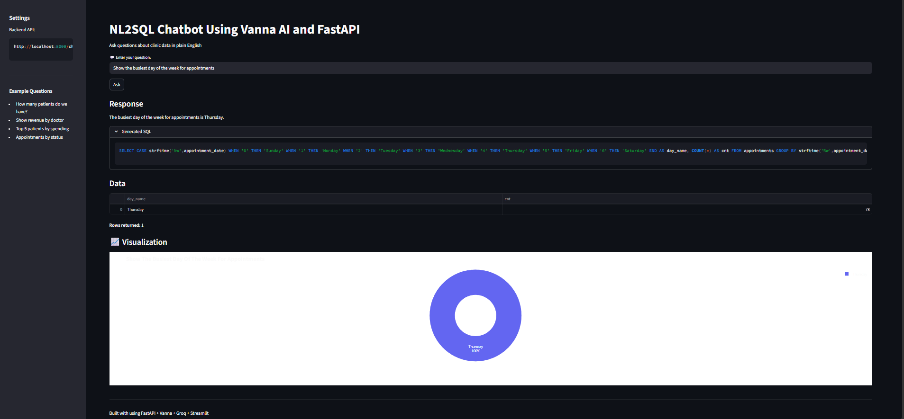

# NL2SQL Clinic Chatbot

> AI-powered Natural Language to SQL system built with **Vanna AI 2.0**, **FastAPI**, and **Groq**.

Users type questions in plain English — the system generates valid SQLite SQL, executes it against a clinic database, and returns results with data tables and Plotly charts. No SQL knowledge required.

---

## Table of Contents

1. [Project Description](#1-project-description)
2. [Tech Stack](#2-tech-stack)
3. [Architecture Overview](#3-architecture-overview)
4. [Database Schema](#4-database-schema)
5. [File Structure](#5-file-structure)
6. [Setup Instructions](#6-setup-instructions)
7. [How to Run Memory Seeding](#7-how-to-run-memory-seeding)
8. [How to Start the API Server](#8-how-to-start-the-api-server)
9. [API Documentation](#9-api-documentation)
10. [LLM Provider Choice](#10-llm-provider-choice)
11. [Bonus Features](#11-bonus-features)


---

## 1. Project Description

This project is a fully working NL2SQL chatbot for a clinic management system, built as a technical screening assignment. It covers:

- A realistic **SQLite clinic database** with 5 tables and ~1,270 rows of dummy data
- A **Vanna 2.0 Agent** that converts English questions into verified SQLite SELECT queries
- A **FastAPI backend** with `/chat` (question → SQL → results) and `/health` endpoints
- **SQL security validation** — blocks INSERT, UPDATE, DELETE, DROP, ALTER, and dangerous keywords
- **Plotly chart generation** — auto-selects bar, line, or pie based on data and question phrasing
- **In-memory response cache** and **per-IP rate limiting**
- An optional **Streamlit browser frontend**

**LLM Provider:** Groq — `llama-3.3-70b-versatile` (free tier, no credit card)

---

## Streamlit UI Screenshot

> The optional Streamlit frontend (`streamlit_app.py`) running at `http://localhost:8501`



The UI provides:
- **Sidebar** — configurable backend API URL and example questions for quick access
- **Question input** — plain English text box with an Ask button
- **Response section** — natural language summary of the result
- **Generated SQL** — collapsible block showing the exact SQL that was executed
- **Data table** — raw query results displayed as a DataFrame
- **Visualization** — interactive Plotly chart (bar / line / pie) auto-selected based on the data shape and question phrasing

---

## 2. Tech Stack

| Technology | Version | Purpose |
|---|---|---|
| Python | 3.10+ | Backend language |
| Vanna | 2.0.x | AI Agent for NL2SQL |
| FastAPI | Latest | REST API framework |
| SQLite | Built-in | Database — no installation needed |
| Groq | Free tier | LLM provider (Option B) |
| `llama-3.3-70b-versatile` | via Groq | SQL generation model |
| OpenAI SDK | Latest | Groq API client (OpenAI-compatible) |
| Plotly | Latest | Chart generation |
| Streamlit | Latest | Optional browser UI |
| Uvicorn | Latest | ASGI server |
| Pydantic | v2 | Request/response validation |

---

## 3. Architecture Overview

```
┌─────────────────────────────────────────────────────────────────┐
│                    User / Streamlit UI                          │
│                 (plain English question)                        │
└──────────────────────────────┬──────────────────────────────────┘
                               │  HTTP POST /chat
                               ▼
┌─────────────────────────────────────────────────────────────────┐
│                    FastAPI   main.py                            │
│                                                                 │
│   • Rate limiter    20 req/min per IP (sliding window)         │
│   • Cache check     in-memory LRU, 100 entries                 │
│   • Input validate  question: 2–500 characters (Pydantic)      │
└──────────────────────────────┬──────────────────────────────────┘
                               │
                  ┌────────────┴────────────┐
                  │                         │
          PRIMARY PATH               RECOVERY PATH
      (Vanna 2.0 Agent)         (Groq tool-call bug)
                  │                         │
                  ▼                         ▼
┌─────────────────────────┐   ┌─────────────────────────────────┐
│   Vanna 2.0 Agent       │   │   Direct Groq Call              │
│   vanna_setup.py        │   │   _direct_sql()  main.py        │
│                         │   │                                 │
│ LLM: Groq               │   │ Same model, same schema,        │
│  llama-3.3-70b-versatile│   │ same 20 examples — but NO       │
│  parallel_tool_calls=False  │ tool-calling wrapper.           │
│                         │   │ Immune to streaming crash.      │
│ Tool: RunSqlTool        │   │                                 │
│  └─ SqliteRunner        │   │ Triggered when agent throws     │
│      └─ clinic.db       │   │ "Failed to call a function"     │
│                         │   │ OR agent SQL fails in DB.       │
│ Memory: DemoAgentMemory │   │                                 │
│  └─ 20 seeded Q→SQL pairs   │ Partial/corrupt SQL from        │
│                         │   │ crashed agent is DISCARDED      │
│ System prompt contains: │   │ before this path runs.         │
│  • Full DB schema       │   └──────────────┬──────────────────┘
│  • SQLite-only rules    │                  │
│  • Forbidden columns    │                  │
│  • All 20 Q→SQL examples│                  │
└──────────┬──────────────┘                  │
           │                                 │
           └──────────────┬──────────────────┘
                          │  Generated SQL
                          ▼
┌─────────────────────────────────────────────────────────────────┐
│                  SQL Auto-Fixer   _fix_sql()                    │
│                                                                 │
│  Converts MySQL/PostgreSQL → SQLite silently:                   │
│  DAYNAME(col)    → CASE strftime('%w', col) WHEN '0' ... END    │
│  MONTH(col)      → CAST(strftime('%m', col) AS INTEGER)         │
│  YEAR(col)       → CAST(strftime('%Y', col) AS INTEGER)         │
│  NOW()           → datetime('now')                              │
│  CURRENT_DATE    → date('now')                                  │
│  WHERE paid_date IS NULL  → WHERE 1=1                           │
│  i.due_date < x  → i.status = 'Overdue'                        │
│  p.patient_id (select) → p.id                                   │
└──────────────────────────┬──────────────────────────────────────┘
                           │  fixed SQL
                           ▼
┌─────────────────────────────────────────────────────────────────┐
│               SQL Validator   sql_validator.py                  │
│                                                                 │
│  ✗ Blocks: INSERT / UPDATE / DELETE / DROP / ALTER / TRUNCATE   │
│  ✗ Blocks: EXEC / xp_ / sp_ / GRANT / REVOKE / SHUTDOWN        │
│  ✗ Blocks: sqlite_master / information_schema access            │
│  ✗ Blocks: multiple statements (semicolon check)                │
│  ✓ Allows: SELECT, WITH, EXPLAIN only                           │
└──────────────────────────┬──────────────────────────────────────┘
                           │  safe, valid SQL
                           ▼
┌─────────────────────────────────────────────────────────────────┐
│                    clinic.db  (SQLite)                          │
│                                                                 │
│   patients (200)  ·  doctors (15)  ·  appointments (500)        │
│   treatments (256)  ·  invoices (300)                           │
└──────────────────────────┬──────────────────────────────────────┘
                           │  columns + rows
                           ▼
┌─────────────────────────────────────────────────────────────────┐
│               Chart Generator   chart_generator.py              │
│                                                                 │
│  line  — question contains: trend / monthly / over time         │
│  pie   — ≤6 rows AND question contains: breakdown / share / %   │
│  bar   — all other cases with numeric data                      │
│  none  — no numeric column or insufficient data                 │
└──────────────────────────┬──────────────────────────────────────┘
                           │
                           ▼
┌─────────────────────────────────────────────────────────────────┐
│                     JSON Response                               │
│                                                                 │
│  {                                                              │
│    "message":    "Found 5 results for ...",                     │
│    "sql_query":  "SELECT ...",                                  │
│    "columns":    ["col1", "col2", ...],                         │
│    "rows":       [[val, val], ...],                             │
│    "row_count":  5,                                             │
│    "chart":      { "data": [...], "layout": {...} },            │
│    "chart_type": "bar",                                         │
│    "cached":     false                                          │
│  }                                                              │
└──────────────────────────┬──────────────────────────────────────┘
                           │
                           ▼
┌─────────────────────────────────────────────────────────────────┐
│            Streamlit UI   streamlit_app.py   (optional)         │
│            http://localhost:8501                                │
│                                                                 │
│   • Text input for question                                     │
│   • Expandable block showing generated SQL                      │
│   • DataFrame table of results                                  │
│   • Interactive Plotly chart                                    │
└─────────────────────────────────────────────────────────────────┘
```

---

## 4. Database Schema

### patients — 200 rows
| Column | Type | Notes |
|---|---|---|
| id | INTEGER PK | Auto-increment |
| first_name | TEXT NOT NULL | |
| last_name | TEXT NOT NULL | |
| email | TEXT | Nullable (~10% null) |
| phone | TEXT | Nullable (~15% null) |
| date_of_birth | DATE | 1950–2010 range |
| gender | TEXT | M / F |
| city | TEXT | 10 Indian cities |
| registered_date | DATE | Past 12 months |

### doctors — 15 rows
| Column | Type | Notes |
|---|---|---|
| id | INTEGER PK | |
| name | TEXT NOT NULL | |
| specialization | TEXT | Dermatology, Cardiology, Orthopedics, General Medicine, Pediatrics |
| department | TEXT | |
| phone | TEXT | |

### appointments — 500 rows
| Column | Type | Notes |
|---|---|---|
| id | INTEGER PK | |
| patient_id | INTEGER | FK → patients.id |
| doctor_id | INTEGER | FK → doctors.id |
| appointment_date | DATETIME | Past 12 months |
| status | TEXT | Scheduled / Completed / Cancelled / No-Show |
| notes | TEXT | Nullable |

### treatments — 256 rows
| Column | Type | Notes |
|---|---|---|
| id | INTEGER PK | |
| appointment_id | INTEGER | FK → appointments.id (Completed only) |
| treatment_name | TEXT | |
| cost | REAL | ₹300–₹6500 range |
| duration_minutes | INTEGER | |

### invoices — 300 rows
| Column | Type | Notes |
|---|---|---|
| id | INTEGER PK | |
| patient_id | INTEGER | FK → patients.id |
| invoice_date | DATE | |
| total_amount | REAL | |
| paid_amount | REAL | |
| status | TEXT | Paid / Pending / Overdue |

---

## 5. File Structure

```
project/
├── main.py              # FastAPI app — /chat and /health endpoints
├── vanna_setup.py       # Vanna 2.0 Agent — LLM, tool, memory, system prompt
├── setup_database.py    # Creates clinic.db with schema + dummy data
├── seed_memory.py       # Seeds DemoAgentMemory with 20 verified Q→SQL pairs
├── sql_validator.py     # SQL security validation (SELECT-only guard)
├── chart_generator.py   # Plotly chart generation (bar / line / pie)
├── streamlit_app.py     # Optional Streamlit browser frontend
├── requirements.txt     # All Python dependencies
├── clinic.db            # Generated SQLite database
├── .env                 # GROQ_API_KEY — never commit to git
├── README.md            # This file
└── RESULTS.md           # Test results + complete error history
```

---

## 6. Setup Instructions

### Prerequisites
- Python 3.10 or higher
- A free Groq API key from https://console.groq.com (no credit card required)

---

### Step 1 — Get the project

```bash
git clone <your-repo-url>
cd project
```

---

### Step 2 — Create a virtual environment

```bash
python -m venv venv

# Windows
venv\Scripts\activate

# macOS / Linux
source venv/bin/activate
```

---

### Step 3 — Create your `.env` file

Create a file named `.env` in the project root:

```
GROQ_API_KEY=your_groq_api_key_here
```

**How to get a free key:**
1. Go to https://console.groq.com
2. Sign up (free, no credit card)
3. Click **API Keys** → **Create API Key**
4. Copy the key into your `.env` file

---

### Step 4 — Install dependencies

```bash
pip install -r requirements.txt
```

---

### Step 5 — Create the database

```bash
python setup_database.py
```

Expected output:
```
==================================================
  clinic.db created successfully!
==================================================
  patients       : 200
  doctors        : 15
  appointments   : 500
  treatments     : 256
  invoices       : 300
==================================================
```

---

### Step 6 — Seed agent memory

```bash
python seed_memory.py
```

Expected output:
```
Connecting to Vanna 2.0 agent...
Seeding 20 Q&A pairs into DemoAgentMemory...
  [ 1/20] How many patients do we have?
  [ 2/20] List all doctors and their specializations
  ...
  [20/20] Show patient registration trend by month

Done! 20 pairs seeded.
Agent will retrieve these as examples when generating SQL.
```

> **Note:** Run Steps 5 and 6 only once. After that, only Step 7 is needed each time.

---

### Step 7 — Start the API server

```bash
uvicorn main:app --port 8000 --reload
```

Server is live at **http://localhost:8000**

Verify immediately:
```bash
curl http://localhost:8000/health
```

---

### Step 8 — (Optional) Start Streamlit UI

Open a **second terminal**, activate venv, then:

```bash
streamlit run streamlit_app.py
```

Open browser at **http://localhost:8501**

---

## 7. How to Run Memory Seeding

```bash
python seed_memory.py
```

This calls `agent.agent_memory.save_tool_usage()` for each of the 20 verified Q→SQL pairs, storing them in `DemoAgentMemory`. The agent uses these as verified examples when generating new SQL.

**Run this script:**
- Once after `setup_database.py` on first setup
- Every time after restarting `uvicorn` — DemoAgentMemory is **in-memory only** and does not survive server restarts
- Again if you delete and recreate `clinic.db`

---

## 8. How to Start the API Server

```bash
# Development — auto-reloads on code changes
uvicorn main:app --port 8000 --reload

# Production
uvicorn main:app --host 0.0.0.0 --port 8000 --workers 1
```

**One-command full setup:**
```bash
pip install -r requirements.txt && python setup_database.py && python seed_memory.py && uvicorn main:app --port 8000
```

---

## 9. API Documentation

### `POST /chat`

Converts a plain English question into SQL, executes it, and returns results with an optional chart.

**URL:** `http://localhost:8000/chat`  
**Method:** POST  
**Content-Type:** application/json

#### Request

```json
{
  "question": "Show me the top 5 patients by total spending"
}
```

Constraints: `question` must be 2–500 characters.

#### Response

```json
{
  "message":    "Found 5 results for: \"Show me the top 5 patients by total spending\".",
  "sql_query":  "SELECT p.first_name, p.last_name, ROUND(SUM(i.total_amount),2) AS total_spent FROM patients p JOIN invoices i ON i.patient_id = p.id GROUP BY p.id ORDER BY total_spent DESC LIMIT 5",
  "columns":    ["first_name", "last_name", "total_spent"],
  "rows":       [["Arjun", "Sharma", 14820.50], ["Priya", "Patel", 13200.00]],
  "row_count":  5,
  "chart":      { "data": [...], "layout": {...} },
  "chart_type": "pie",
  "cached":     false
}
```

#### Response fields

| Field | Type | Description |
|---|---|---|
| `message` | string | Agent summary or default count/found message |
| `sql_query` | string / null | Generated SQL that was executed |
| `columns` | array / null | Column names |
| `rows` | array / null | Nested array of result values |
| `row_count` | int / null | Number of rows |
| `chart` | object / null | Plotly `{data, layout}` dict — null if not applicable |
| `chart_type` | string / null | `"bar"`, `"line"`, `"pie"`, or `""` |
| `cached` | boolean | `true` if served from in-memory cache |

#### Error responses

| Situation | `message` | `error_type` |
|---|---|---|
| Groq rate limit | `"⚠️ Groq API rate limit reached. Please wait N seconds..."` | `"rate_limit"` |
| SQL blocked by validator | `"SQL rejected: Only SELECT queries are permitted..."` | null |
| DB error (both paths fail) | `"Database error: ..."` | `"db_error"` |
| No rows returned | `"Query returned no results."` | null |

#### cURL examples

```bash
# Count
curl -X POST http://localhost:8000/chat \
  -H "Content-Type: application/json" \
  -d "{\"question\": \"How many patients do we have?\"}"

# Aggregation + JOIN
curl -X POST http://localhost:8000/chat \
  -H "Content-Type: application/json" \
  -d "{\"question\": \"Which doctor has the most appointments?\"}"

# Revenue
curl -X POST http://localhost:8000/chat \
  -H "Content-Type: application/json" \
  -d "{\"question\": \"What is the total revenue?\"}"

# Multi-table JOIN
curl -X POST http://localhost:8000/chat \
  -H "Content-Type: application/json" \
  -d "{\"question\": \"Show revenue by doctor\"}"

# Time series
curl -X POST http://localhost:8000/chat \
  -H "Content-Type: application/json" \
  -d "{\"question\": \"Revenue trend by month\"}"
```

---

### `GET /health`

Returns system status.

```bash
curl http://localhost:8000/health
```

```json
{
  "status": "ok",
  "database": "connected",
  "llm_provider": "groq/llama-3.3-70b-versatile",
  "agent_memory_items": 20
}
```

---

## 10. LLM Provider Choice

**Option B — Groq** (`llama-3.3-70b-versatile`)

| Setting | Value |
|---|---|
| Provider | Groq |
| Model | `llama-3.3-70b-versatile` |
| Vanna import | `from vanna.integrations.openai import OpenAILlmService` |
| Base URL | `https://api.groq.com/openai/v1` |
| API key env var | `GROQ_API_KEY` |
| Free tier | Yes — ~30 req/min, no credit card |

**Why not `llama-3.1-8b-instant`:** The 8b model hallucinates table names (`sales`, `payments`, `patient_bills`), column names (`patient_name`, `DAY_OF_WEEK`, `specialization` on treatments), and uses MySQL functions (`DAYNAME()`, `EXTRACT()`) instead of SQLite syntax. The 70b model follows schema constraints reliably. See RESULTS.md for the full error history.

---

## 11. Bonus Features

| Feature | Implementation |
|---|---|
| Chart generation | Plotly bar/line/pie — auto-selected by row count + question keywords |
| Input validation | Pydantic `Field(min_length=2, max_length=500)` on question field |
| Query caching | In-memory LRU dict, 100 entries, keyed by lowercase question |
| Rate limiting | Sliding window — 20 requests per 60 seconds per IP address |
| Structured logging | Timestamped logs at every pipeline step with stage, row count, chart type |

---

